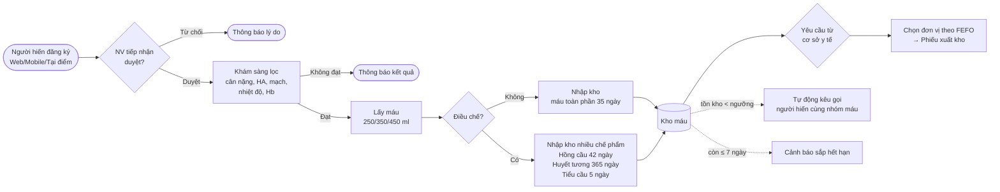
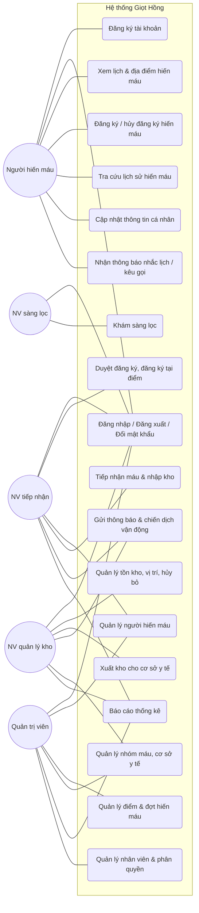
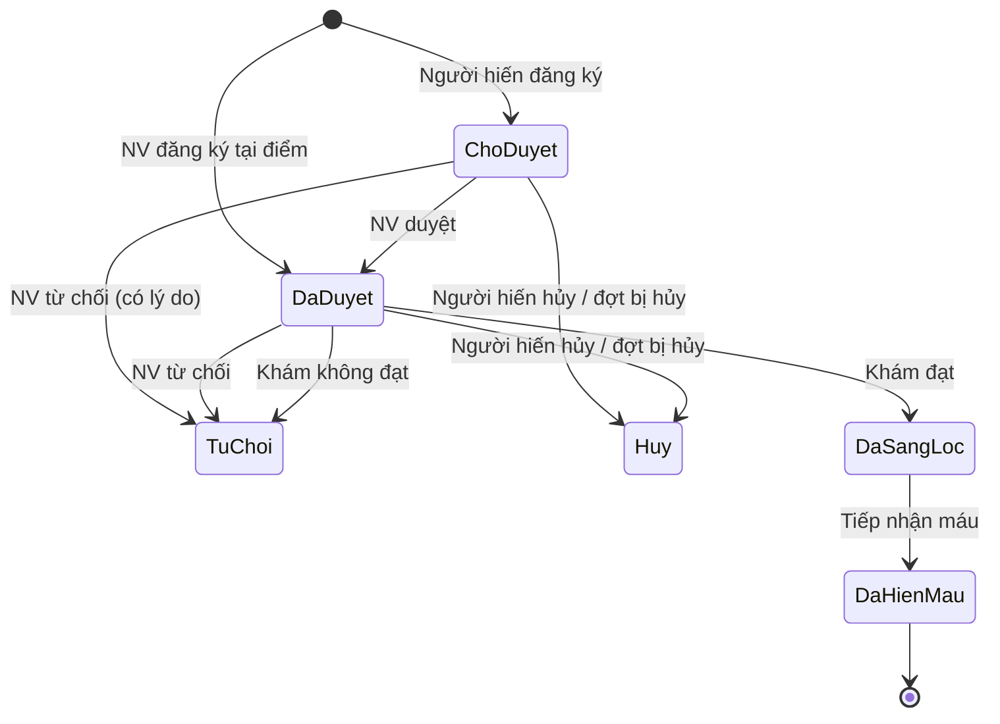
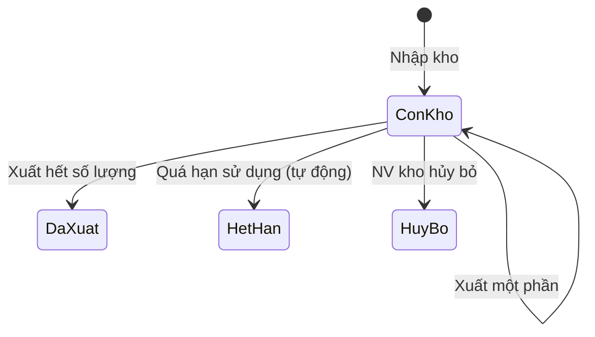
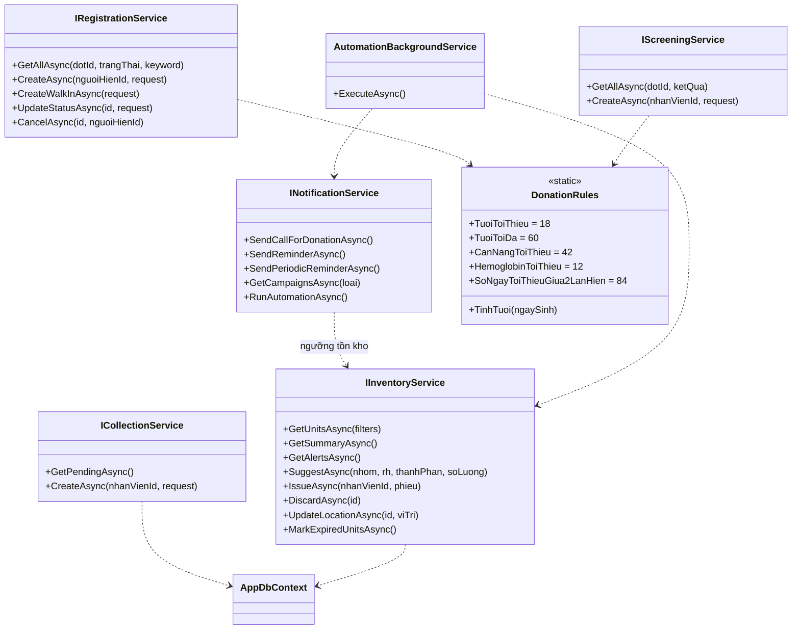
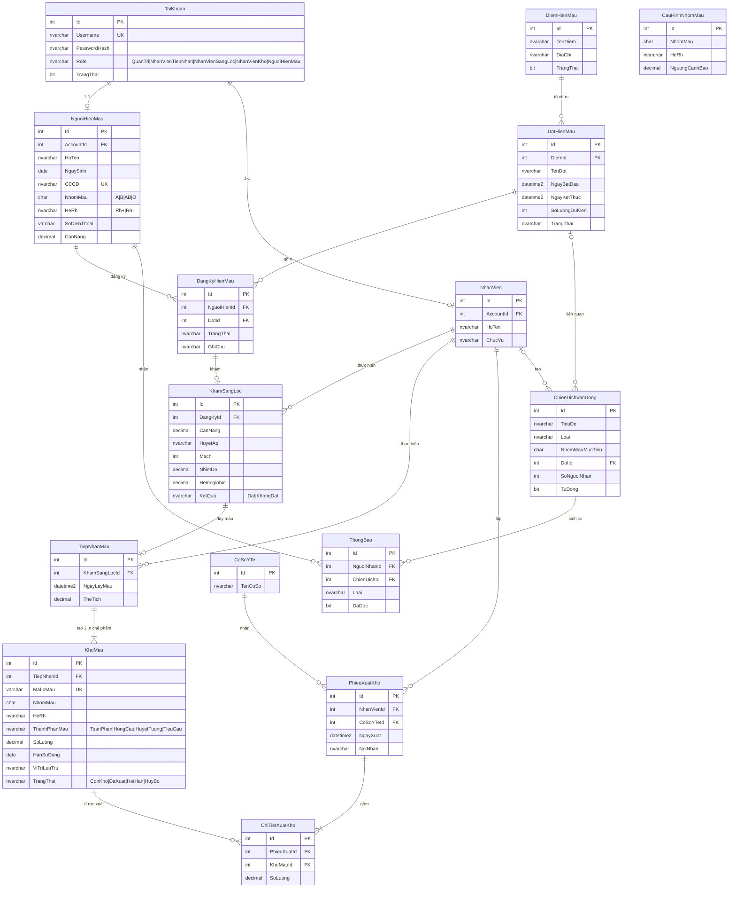

# Tài liệu Phân tích & Thiết kế — Hệ thống Quản lý Hiến máu Nhân đạo "Giọt Hồng"

> Tài liệu đi kèm mã nguồn, dùng làm cơ sở cho các chương Phân tích – Thiết kế – Cài đặt – Kiểm thử của quyển báo cáo.
> Các sơ đồ viết bằng Mermaid (xem trực tiếp trên GitHub, VS Code với extension *Markdown Preview Mermaid*, hoặc dán vào https://mermaid.live để xuất ảnh PNG cho báo cáo).

---

## 1. Khảo sát & xác định yêu cầu

### 1.1. Tác nhân (Actor)

| Tác nhân | Mô tả | Nền tảng |
|---|---|---|
| Người hiến máu | Đăng ký tài khoản, đăng ký hiến máu, xem lịch/địa điểm, tra cứu lịch sử, nhận thông báo | Web, Mobile |
| Nhân viên tiếp nhận | Duyệt đăng ký, tiếp đón người hiến tại điểm, lấy máu & nhập kho | Web |
| Nhân viên sàng lọc (bác sĩ) | Khám sàng lọc, kết luận đủ/không đủ điều kiện | Web |
| Nhân viên quản lý kho | Quản lý tồn kho, vị trí lưu trữ, xuất kho cho cơ sở y tế, vận động khi thiếu máu | Web |
| Quản trị viên | Toàn quyền: điểm/đợt hiến máu, nhân viên & phân quyền, danh mục, báo cáo | Web |
| Hệ thống (tác vụ nền) | Tự cập nhật trạng thái đợt, đánh dấu máu hết hạn, nhắc lịch, kêu gọi khi thiếu máu | Backend |

### 1.2. Quy trình nghiệp vụ tổng thể



---

## 2. Phân tích hệ thống

### 2.1. Sơ đồ Use-case hệ thống



> Quản trị viên kế thừa toàn bộ quyền của các nhân viên (thể hiện bằng quan hệ *generalization* khi vẽ bằng StarUML / draw.io).

### 2.2. Ma trận phân quyền

| Chức năng | Quản trị | Tiếp nhận | Sàng lọc | Kho | Người hiến |
|---|:-:|:-:|:-:|:-:|:-:|
| Xem / sửa người hiến | ✔ / ✔ | ✔ / ✔ | ✔ / – | ✔ / – | hồ sơ của mình |
| Khóa người hiến, quản lý nhân viên | ✔ | – | – | – | – |
| Điểm & đợt hiến máu (CRUD) | ✔ | – | – | – | xem |
| Duyệt đăng ký, đăng ký tại điểm | ✔ | ✔ | – | – | đăng ký / hủy |
| Khám sàng lọc | ✔ | xem | ✔ | – | – |
| Tiếp nhận & nhập kho | ✔ | ✔ | – | – | – |
| Xem tồn kho | ✔ | ✔ | – | ✔ | – |
| Xuất kho, hủy bỏ, vị trí lưu trữ | ✔ | – | – | ✔ | – |
| Nhóm máu (ngưỡng), cơ sở y tế | ✔ | – | – | ✔ | – |
| Thông báo & vận động | ✔ | ✔ | – | ✔ | nhận |
| Báo cáo thống kê | ✔ | ✔ | dashboard | ✔ | – |

Phân quyền được kiểm tra hai lớp: **API** (`[Authorize(Roles = ...)]` trên từng action) và **giao diện** (menu, route guard).

### 2.3. Đặc tả các use-case chính

#### UC4 — Đăng ký hiến máu
| Mục | Nội dung |
|---|---|
| Tác nhân | Người hiến máu (web/mobile); NV tiếp nhận (đăng ký tại điểm) |
| Tiền điều kiện | Đã đăng nhập, tài khoản đang hoạt động |
| Luồng chính | 1. Chọn đợt hiến máu → 2. Xem chi tiết → 3. Bấm *Đăng ký*, nhập ghi chú → 4. Hệ thống kiểm tra ràng buộc → 5. Tạo đăng ký trạng thái *Chờ duyệt* (tại điểm: *Đã duyệt*) → 6. Gửi thông báo xác nhận |
| Ràng buộc (bước 4) | Tuổi 18–60; đợt chưa kết thúc/hủy; chưa đăng ký đợt này; không có đăng ký khác còn hiệu lực; chưa vượt số lượng dự kiến; đã đủ **84 ngày** kể từ lần lấy máu gần nhất |
| Ngoại lệ | Vi phạm ràng buộc → thông báo lỗi cụ thể (vd: "Cần chờ thêm 23 ngày…") |
| Hậu điều kiện | Đăng ký xuất hiện trong danh sách chờ duyệt của NV tiếp nhận |

#### UC10 — Khám sàng lọc
| Mục | Nội dung |
|---|---|
| Tác nhân | NV sàng lọc |
| Tiền điều kiện | Đăng ký ở trạng thái *Đã duyệt*, chưa có kết quả khám |
| Luồng chính | 1. Chọn người hiến trong danh sách chờ khám → 2. Nhập cân nặng, huyết áp, mạch, nhiệt độ, Hemoglobin → 3. Bảng kiểm tự đánh giá từng tiêu chuẩn → 4. Chọn kết luận → 5. Lưu, cập nhật đăng ký thành *Đạt sàng lọc* / *Không đạt*, gửi thông báo |
| Quy tắc | Kết luận *Đạt* chỉ khi: cân nặng ≥ 42 kg, HA 90–160/60–100, mạch 50–100, nhiệt độ ≤ 37,5 °C, Hb ≥ 12 g/dL. *Không đạt* bắt buộc nhập lý do |

#### UC11 — Tiếp nhận máu & nhập kho (nghiệp vụ phức tạp 1)
| Mục | Nội dung |
|---|---|
| Tác nhân | NV tiếp nhận |
| Tiền điều kiện | Kết quả sàng lọc *Đạt*, chưa có phiếu tiếp nhận |
| Luồng chính | 1. Chọn người hiến chờ lấy máu → 2. Chọn thể tích → 3. Chọn *nhập nguyên túi* hoặc *điều chế tách thành phần* → 4. Nhập vị trí lưu trữ → 5. Hệ thống tạo `TiepNhanMau` và một/nhiều `KhoMau` trong **một transaction**, sinh mã đơn vị `LM{yyMMdd}{id}{TP/HC/HT/TC}`, hạn dùng theo thành phần → 6. Đăng ký → *Đã hiến máu*, gửi thông báo cảm ơn kèm ngày được hiến lại |
| Luồng phụ | Người hiến chưa biết nhóm máu → bắt buộc nhập kết quả xét nghiệm, lưu vào hồ sơ |
| Ngoại lệ | Tổng thể tích thành phần > thể tích lấy; trùng thành phần; hạn dùng ≤ hôm nay → từ chối, không ghi dữ liệu |

#### UC13 — Xuất kho (nghiệp vụ phức tạp 2)
| Mục | Nội dung |
|---|---|
| Tác nhân | NV quản lý kho |
| Luồng chính | 1. Chọn cơ sở y tế, nhập lý do → 2. Nhập các dòng yêu cầu (nhóm máu, Rh, thành phần, ml) → 3. Hệ thống gợi ý đơn vị theo **FEFO** (hạn gần nhất trước) → 4. Điều chỉnh số lượng → 5. Xác nhận → hệ thống kiểm tra **toàn bộ** phiếu rồi mới ghi (transaction), trừ tồn, lô hết số lượng → *Đã xuất* → 6. In phiếu xuất |
| Luồng phụ | Không đủ máu → hiển thị lượng thiếu và nhóm máu tương thích thay thế, gợi ý gửi kêu gọi |
| Ngoại lệ | Lô hết hạn / không còn trong kho / xuất vượt tồn → từ chối toàn bộ phiếu |

#### UC14 — Thông báo & vận động hiến máu
| Mục | Nội dung |
|---|---|
| Tác nhân | NV kho, NV tiếp nhận, Quản trị viên; Hệ thống (tự động) |
| Luồng chính | Chọn loại (kêu gọi theo nhóm máu / nhắc lịch theo đợt / nhắc định kỳ / thông báo chung) → nhập nội dung → hệ thống lọc người nhận phù hợp → tạo `ChienDichVanDong` + `ThongBao` cho từng người |
| Tự động (60 phút/lần) | Nhắc lịch trước 2 ngày; nhắc người đã đủ 12 tuần (không nhắc lặp); nhóm máu dưới ngưỡng → kêu gọi người cùng nhóm đã đủ điều kiện (tối đa 1 lần/3 ngày/nhóm) |
| Kết quả | Mobile nhận thông báo hệ thống; quản lý xem lịch sử chiến dịch và tỷ lệ đã đọc |

### 2.4. Sơ đồ trạng thái

**Đăng ký hiến máu**


**Đơn vị máu trong kho**


**Đợt hiến máu**: `SapDienRa → DangDienRa → DaKetThuc` (tự động theo ngày, chỉ đi tiến), `SapDienRa/DangDienRa → DaHuy` (quản trị hủy, tự hủy các đăng ký và thông báo).

### 2.5. Sơ đồ tuần tự — Xuất kho theo FEFO

```mermaid
sequenceDiagram
    actor K as NV quản lý kho
    participant W as Web (Issues.jsx)
    participant C as InventoryController
    participant S as InventoryService
    participant DB as SQL Server
    K->>W: Nhập yêu cầu (O Rh+, Hồng cầu, 500 ml)
    W->>C: GET /api/inventory/suggest
    C->>S: SuggestAsync()
    S->>DB: SELECT KhoMau còn kho, cùng nhóm/thành phần ORDER BY HanSuDung
    S-->>W: Danh sách đơn vị + số lượng xuất
    K->>W: Xác nhận xuất kho
    W->>C: POST /api/inventory/issue
    C->>S: IssueAsync(nhanVienId, phiếu)
    S->>S: Kiểm tra TẤT CẢ dòng (tồn, hạn, trạng thái)
    S->>DB: BEGIN TRAN; INSERT PhieuXuatKho, ChiTietXuatKho; UPDATE KhoMau; COMMIT
    S-->>W: Phiếu PX000xx
    W-->>K: Hiển thị & in phiếu xuất
```

---

## 3. Thiết kế

### 3.1. Kiến trúc

- **Backend** phân lớp: `Controllers` (HTTP, phân quyền) → `Services` (nghiệp vụ, transaction) → `AppDbContext` (EF Core) → SQL Server. DTO tách biệt entity.
- **Web** React SPA, gọi API qua axios, JWT lưu localStorage; khi triển khai được nhúng vào `wwwroot` của API.
- **Mobile** Flutter, Provider quản lý trạng thái; `http` gọi cùng API; thông báo hệ thống bằng `flutter_local_notifications`.
- **Tác vụ nền** `AutomationBackgroundService` (IHostedService) chạy định kỳ.

### 3.2. Sơ đồ lớp thiết kế (tầng nghiệp vụ)



Các service khác: `IAuthService`, `IDonorService`, `ICampaignService`, `ICatalogService`, `IReportService`, `IStaffService` (xem `backend/HienMauAPI/Services`).

### 3.3. Mô hình dữ liệu (15 bảng)



Ràng buộc toàn vẹn chính (xem `database/HienMauNhanDao_CreateDB.sql`): `CHECK` cho mọi cột liệt kê (vai trò, nhóm máu, Rh, trạng thái, thành phần, kết quả); `UNIQUE (NguoiHienId, DotId)`; `UNIQUE` CCCD, mã đơn vị máu; `CHECK (NgayKetThuc >= NgayBatDau)`, `SoLuong >= 0`; index theo nhóm máu và hạn sử dụng.

### 3.4. Thiết kế giao diện

Ảnh chụp màn hình thực tế nằm trong [`docs/screenshots/`](screenshots/). Nguyên tắc: một màu chủ đạo đỏ máu `#C8102E`, font *Be Vietnam Pro*, bố cục quản trị dạng sidebar theo vai trò; cổng người hiến dạng landing page; mobile Material 3 với thanh điều hướng 5 mục.

---

## 4. Kiểm thử

### 4.1. Kiểm thử đơn vị (tự động) — `dotnet test` (48 test)

| Nhóm | Nội dung kiểm thử |
|---|---|
| Xác thực | Băm/kiểm tra mật khẩu, đăng nhập sai, tài khoản khóa, đăng ký tuổi không hợp lệ, đổi mật khẩu |
| Đăng ký hiến máu | Trùng đăng ký, khoảng cách 84 ngày, đợt kết thúc, chuyển trạng thái hợp lệ/không hợp lệ, đủ số lượng, một đăng ký hiệu lực, đăng ký tại điểm |
| Sàng lọc | Từ chối kết luận *Đạt* khi thiếu cân, Hb thấp, huyết áp cao |
| Tiếp nhận | Chỉ nhận người đạt sàng lọc, không tiếp nhận 2 lần, hạn dùng quá khứ, nhập nhóm máu khi chưa biết, tách thành phần, vượt thể tích |
| Kho máu | Xuất một phần/toàn bộ, vượt tồn, lô hết hạn, nhiều lô, phiếu không mồ côi, FEFO, thiếu hàng, xuất theo cơ sở y tế |
| Vận động | Bỏ qua người chưa đủ 12 tuần, lưu lịch sử chiến dịch, tự chuyển trạng thái đợt |

### 4.2. Kiểm thử chức năng (thủ công) — kịch bản demo

| # | Kịch bản | Tài khoản | Kết quả mong đợi |
|---|---|---|---|
| 1 | Người hiến đăng ký đợt sắp diễn ra trên app mobile | `nguoihienXX` | Đăng ký *Chờ duyệt*, có thông báo xác nhận |
| 2 | Đăng ký lần 2 khi đang có đăng ký hiệu lực | như trên | Báo lỗi "Đang có đăng ký còn hiệu lực…" |
| 3 | Duyệt đăng ký | `nv.tiepnhan01` | Trạng thái *Đã duyệt*, người hiến nhận thông báo |
| 4 | Khám với Hb = 11 và chọn *Đạt* | `nv.sangloc01` | Nút *Đạt* bị khóa, bảng kiểm báo đỏ |
| 5 | Tiếp nhận 450 ml, tách 3 thành phần | `nv.tiepnhan01` | Tạo 3 đơn vị với hạn 42/365/5 ngày |
| 6 | Xuất 500 ml hồng cầu O+ cho BV Chợ Rẫy | `nv.kho01` | Đơn vị gần hết hạn được chọn trước, tồn kho giảm, in được phiếu |
| 7 | Hạ ngưỡng / chờ tác vụ nền khi nhóm máu thiếu | `nv.kho01` | Người hiến cùng nhóm nhận "Khẩn cấp: cần máu nhóm…" |
| 8 | NV sàng lọc mở trang Xuất kho bằng URL | `nv.sangloc01` | Trang 403 "Không có quyền truy cập" |
| 9 | Hủy một đợt hiến máu | `admin` | Đăng ký chưa khám bị hủy, người hiến được thông báo |
| 10 | Người hiến lần đầu đến trực tiếp | `nv.tiepnhan01` | Tạo hồ sơ (tài khoản = CCCD), đăng ký tại điểm, chuyển sang sàng lọc |

### 4.3. Triển khai

- Phát triển: `CHAY_DEMO.bat` (API + Web).
- Đóng gói: `scripts/publish.ps1` → `release/HienMauAPI/HienMauAPI.exe --urls http://0.0.0.0:5000` phục vụ cả website và API trên một cổng; ứng dụng di động cài từ `release/GiotHong.apk`.
